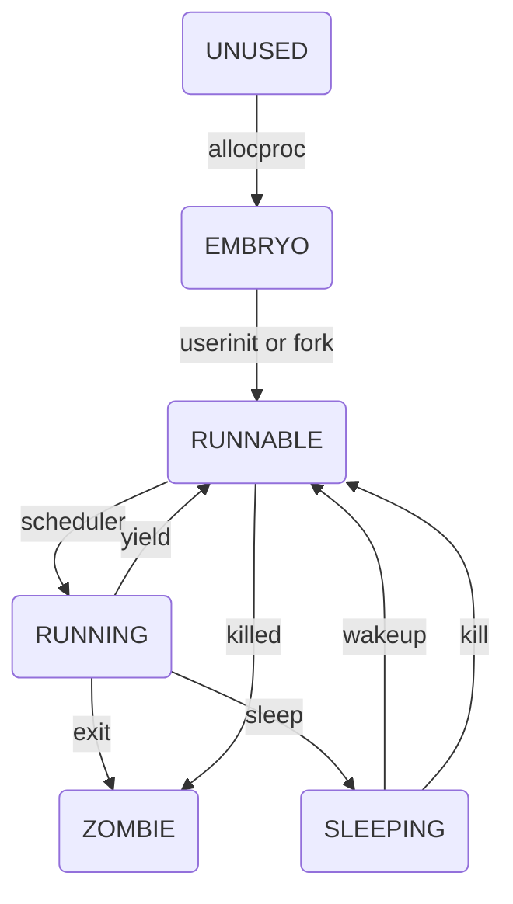

### 代码阅读2
#####  &emsp; &emsp; &emsp;蒲伟良 &emsp; &emsp; &emsp;1600011338
#### 1. 什么是进程，什么是线程？操作系统的资源分配单位和调度单位分别是什么？XV6 中的进程和线程分别是什么，都实现了吗？ 
+ 进程就是正在运行的程序的抽象，一个进程包括了程序计数器、寄存器和当前的变量值，每个进程看起来就像是独占了CPU一样。线程是迷你的进程，归属于进程，多个线程共享一个进程内的某些资源，比如文件和内存，线程比进程轻量，但每个线程又相对独立，切换花销更小。
+ 操作系统资源分配单位是进程，调度的单位是线程（如果没有线程则单位是进程）。
+ xv6中只有进程没有线程，所以只实现了进程。当然，用户线程依然可以又用户编写。Xv6进程的实现在proc.h、proc.c和kalloc.c中都有涉及。

#### 2. 进程管理的数据结构是什么？在 Windows，Linux，XV6 中分别叫什么名字？其中包含哪 些内容？操作系统是如何进行管理进程管理数据结构的？它们是如何初始化的？
+ 进程管理的数据结构是进程控制块，即PCB，管理进程所需要的信息都保存在其中。一般PCB包含的信息可以分为三类，关于进程的信息、使用资源（内存、文件）信息和进程间通信的信息，操作系统会将所有的PCB存储在进程表上，进程表一般是一个数组。
+ 在Windows中PCB叫`_EPROCESS`和`_KPROCESS`，这两个结构都非常复杂，`_EPROCESS`在执行层，包含了在内核层的`_KPROCESS`。`_KPROCESS`中的内容主要分两块，进程环境块（PEB）和线程环境块（TEB），PEB包含了目前已经加载了的模块，环境字符串的内容、当前的工作目录、页目录表等，TEB包含该进程所拥有的线程的信息，比如线程的分片时间和调度方法。`_EPROCESS`除此以外包含唯一标识、文件、锁、内存相关的信息等。
+ Linux中PCB叫`task_struct`，其中包含进程的状态、进程的唯一标识、进程的内核栈、进程的标记、进程的亲属关系、调度信息（包括优先级）、时间数据成员、进程间的通信、信号处理信息、文件系统信息、虚拟内存和页面管理信息。
+ xv6中PCB叫做`proc`，在文件`proc.h`中定义
```c++
// in proc.h
struct proc {
  uint sz;                     // Size of process memory (bytes)
  pde_t* pgdir;                // Page table
  char *kstack;                // Bottom of kernel stack for this process
  enum procstate state;        // Process state
  int pid;                     // Process ID
  struct proc *parent;         // Parent process
  struct trapframe *tf;        // Trap frame for current syscall
  struct context *context;     // swtch() here to run process
  void *chan;                  // If non-zero, sleeping on chan
  int killed;                  // If non-zero, have been killed
  struct file *ofile[NOFILE];  // Open files
  struct inode *cwd;           // Current directory
  char name[16];               // Process name (debugging)
};
```
+ `proc`中包含了三类信息
  + 控制进程的信息：唯一标识、进程状态、中断帧、上下文、阻塞队列、被杀死的标志、名字（用于debug）
  + 进程间通信信息：父进程
  + 使用的资源信息：内存大小、页目录表、内核栈、当前路径、当前目录
+ xv6中用`proc.c`中定义的结构`ptable`存储所有的PCB，`ptable`相当于是进程池，其中有64个进程，进程从进程池中取出后改变其状态来表示被取出（所以每次寻找可用的进程需要逐个搜索）。
```c++
// in proc.c
struct {
  struct spinlock lock;
  struct proc proc[NPROC];
} ptable;
```
+ xv6中进程的初始化在`userinit()`和`fork()`中实现，这两个函数都是啊在`proc.c`中定义的。`userinit()`用于初始化第一个进程，`fork()`则负责初始化处第一个进程外的进程（单CPU的情况下，多CPU没有看）。
```c++
// in proc.c
static struct proc*
allocproc(void)
{
  struct proc *p;
  char *sp;

  acquire(&ptable.lock);

  for(p = ptable.proc; p < &ptable.proc[NPROC]; p++)
    if(p->state == UNUSED)
      goto found;

  release(&ptable.lock);
  return 0;

found:
  p->state = EMBRYO;
  p->pid = nextpid++;

  release(&ptable.lock);

  // Allocate kernel stack.
  if((p->kstack = kalloc()) == 0){
    p->state = UNUSED;
    return 0;
  }
  sp = p->kstack + KSTACKSIZE;

  // Leave room for trap frame.
  sp -= sizeof *p->tf;
  p->tf = (struct trapframe*)sp;

  // Set up new context to start executing at forkret,
  // which returns to trapret.
  sp -= 4;
  *(uint*)sp = (uint)trapret;

  sp -= sizeof *p->context;
  p->context = (struct context*)sp;
  memset(p->context, 0, sizeof *p->context);
  p->context->eip = (uint)forkret;

  return p;
}
```
+ 在看`userinit()`的代码前先看一下`allocproc()`的代码，该函数的作用申请一个新的进程，返回指向该新进程的指针，如果失败则返回0。`allocproc()`首先在进程池中寻找UNUSED的进程，找不到返回0，找到则设置状态为EMBRYO，设置PID，然后通过`kalloc()`函数申请内存。`kalloc()`函数（在`kalloc.c`中定义）会在一个名为`freelist`的链表中取出空闲的内存块（内存块都是4M大小），并返回内存块的地址。回到`allocproc()`函数，会在新申请到的内核栈的栈底部压入中断帧，然后是一个返回地址，用于巧妙地返回到函数`trapret`（将在[第8题](# 8. 其他你认为有趣有价值的问题。)讨论），然后压入一个上下文。中断帧、返回地址和上下文都是用于之后的调度，一系列操作后进程的内核栈如下图。所以`allocproc()`从进程池申请了一个进程，为其申请内核栈空间，并进行一些初始化的设置。

<center>图片来源xv6中文手册</center>
```c++
// in proc.c
void
userinit(void)
{
  struct proc *p;
  extern char _binary_initcode_start[], _binary_initcode_size[];

  p = allocproc();

  initproc = p;
  if((p->pgdir = setupkvm()) == 0)
    panic("userinit: out of memory?");
  inituvm(p->pgdir, _binary_initcode_start, (int)_binary_initcode_size);
  p->sz = PGSIZE;
  memset(p->tf, 0, sizeof(*p->tf));
  p->tf->cs = (SEG_UCODE << 3) | DPL_USER;
  p->tf->ds = (SEG_UDATA << 3) | DPL_USER;
  p->tf->es = p->tf->ds;
  p->tf->ss = p->tf->ds;
  p->tf->eflags = FL_IF;
  p->tf->esp = PGSIZE;
  p->tf->eip = 0;  // beginning of initcode.S

  safestrcpy(p->name, "initcode", sizeof(p->name));
  p->cwd = namei("/");

  // this assignment to p->state lets other cores
  // run this process. the acquire forces the above
  // writes to be visible, and the lock is also needed
  // because the assignment might not be atomic.
  acquire(&ptable.lock);

  p->state = RUNNABLE;

  release(&ptable.lock);
}
```
+ `userinit()`的代码如上，该函数首先申请了一个新的进程，然后设置页目录表，设置内存大小、中断帧、名字、当前路径并调整状态为RUNNABLE，表示该进程已经就绪可以运行了。`userinit()`相当一部分是设置中断帧，目的是令第一个进程看起来也像是通过中断（系统调用）生成的，所以多出了一堆对中断帧的设置，而如果是`fork()`是通过中断到达的，所以会在中断过程中，CPU自动压入一部分中断帧，并用设置的中断函数压入剩余的中断帧（上次代码阅读提到的中断向量表、`alltrap()`函数）。（关于`fork()`函数的细节见[第7题](# 7. 请结合代码简述proc.c 文件中的fork、wait、exit函数分别完成了什么功能。 )


#### 3. 进程有哪些状态？请画出 XV6 的进程状态转化图。在 Linux，XV6 中，进程的状态分别包 括哪些？你认为操作系统的设计者为什么会有这样的设计思路？
+ 进程的状态一般有就绪(RUNNABLE)、执行(RUNNING)、阻塞(SLEEPING)三个状态，当然也可以加入创建和终止共五个状态，还可以加入就绪挂起和阻塞挂起形成七个状态。
+ xv6中状态有6个
```c++
// in proc.h
enum procstate { UNUSED, EMBRYO, SLEEPING, RUNNABLE, RUNNING, ZOMBIE };
```

<center>xv6进程的状态转换图</center>
+ Linux中进程状态有`TASK_RUNNING`（正在执行或就绪），`TASK_INTERRUPTIBLE`（可被打断额睡眠），`TASK_UNINTERRUPTIBLE`（不可中断的睡眠），`__TASK_STOPPED`（进程被停止执行），`__TASK_TRACED`（进程被debugger等进程监视），`EXIT_ZOMBIE`（进程终止，但是父进程还没有获知其信息，暂时不消灭），`EXIT_DEAD`（进程最终消亡）

+ 关于各个进程的状态设计思路
  + 显然RUNNING是必然存在的，但是一个CPU同一时间只能执行一个进程，所以剩下的是RUNNABLE，但是有些进程或是等待IO，或是等待存储，被阻塞了，所以会有SLEEPING，这样就构成了三状态。
  + 考虑到创建进程和终止进程，就有添加了两个状态，当然这两个状态并不是必不可少的，因为我们可以让创建和终止进程的整个过程设置为不可中断，进程一旦创建就是RUNNABLE，一旦终止就不存在了。
  + 设置挂起状态则是让一些长时间不会活动的进程从内存中移出，减少内存的消耗。
  + XV6和Linux中都设置了ZOMBIE，因为进程不再执行后其他进程可能在等待，或者需要关闭文件，释放一些资源。
  + XV6中还设置了UNUSED，用于表示未分配的进程，因为进程的数量有限，xv6用一个定长数组管理所有进程，所以在进程池中所有未分配的进程都是UNUSED。

#### 4. 如何启动多进程（创建子进程）？如何调度多进程？调度算法有哪些？操作系统为何要限制一个CPU最大支持的进程数？XV6中的最大进程数是多少？如何执行进程的切换？ 什么是进程上下文？多进程和多 CPU 有什么关系？ 
+ 在`proc.h`中定义了`fork()`函数，该函数用于创建除了第一个进程外的进程。
+ xv6通过函数`scheduler()`调度进程，调度的方式是从ptable第一个进程开始搜索，直到找到第一个可以执行(RUNNABLE)的进程。当然，调用`scheduler()`之前，一般是上一个进程调用`yield()`自动退出执行状态
+ 调度算法有先来先服务、最短作业优先、最短剩余时间优先、时间片轮转调度、优先级调度、多级队列、最短进程优先、公平共享原则等。
+ 操作系统如果不限制进程的数量，那么过多的进程会降低系统的性能，进程的切换调度的开销很大，太多的进程会给系统带来巨大的挑战，内存大幅度消耗的同时，浪费大量时间在进程切换上，浪费资源，给用户带来不好的体验。
+ xv6的最大进程数在`param.h`中定义，为64。
```c++
#define NPROC        64  // maximum number of processes
```
+ xv6调用`swtch()`函数切换进程，在`swtch.S`中定义，切换进程时实际是切换上下文，上下文在`proc.h`中定义，是5个寄存器，即被调用者保存的寄存器。同时调用`swtch()`时将%esp保存在参数old中。
```c++
// in proc.h
struct context {
  uint edi;
  uint esi;
  uint ebx;
  uint ebp;
  uint eip;
};
```
+ `swtch()`的代码如下，切换进程时会将原来的上下文保存，即将四个寄存器的值保存，这四个寄存器都是被调用者保存的寄存器，最后将%esp保存到%eax所指的地址中，从注释中可知即为`context **old`。取出新的上下文是完全堆成的操作，新的上下文包含%esp，%ebp，%eip，使得切换上下文后相当于切换了执行代码的位置，同时切换了用于存储的栈。并且切换后会返回到调用`swtch()`前的代码。
```asm
# in swtch.S

# Context switch
#
#   void swtch(struct context **old, struct context *new);
# 
# Save the current registers on the stack, creating
# a struct context, and save its address in *old.
# Switch stacks to new and pop previously-saved registers.
.globl swtch
swtch:
  movl 4(%esp), %eax
  movl 8(%esp), %edx

  # Save old callee-saved registers
  pushl %ebp
  pushl %ebx
  pushl %esi
  pushl %edi

  # Switch stacks
  movl %esp, (%eax)
  movl %edx, %esp

  # Load new callee-saved registers
  popl %edi
  popl %esi
  popl %ebx
  popl %ebp
  ret
```
+ xv6中不允许进程直接在用户态切换，需要先陷入内核态，切换到调度器进程，再切换到下一个进程，回到用户态。调度器就是`main()`运行的`scheduler()`，其实也可以看左一个进程，只不过没有在`ptable`中占据一个槽位，该进程一直循环运行一个函数，即`sechduler()`（代码如下），该函数一直循环，从头到尾逐个寻找就绪的进程，然后切换到该进程，切换时使用swtch函数，将原来的上下文（调度器的上下文）保存到cpu中，然后载入新的进程。当一个进程因为阻塞、时间分片等中断陷入内核时，会调用`yield()`主动放弃对cpu的占用，调整状态为就绪，然后会调用`sched()`函数（进程调用`exit()`不会调用`yield()`，但会直接调用`sched()`），该函数会将该进程的上下文保存到PCB中，然后从CPU中取出之前保存的上下文，即回到调度器，调度器会继续寻找下一个可执行的进程。
```c++
//in proc.c
void
scheduler(void)
{
  struct proc *p;
  struct cpu *c = mycpu();
  c->proc = 0;
  
  for(;;){
    // Enable interrupts on this processor.
    sti();

    // Loop over process table looking for process to run.
    acquire(&ptable.lock);
    for(p = ptable.proc; p < &ptable.proc[NPROC]; p++){
      if(p->state != RUNNABLE)
        continue;

      // Switch to chosen process.  It is the process's job
      // to release ptable.lock and then reacquire it
      // before jumping back to us.
      c->proc = p;
      switchuvm(p);
      p->state = RUNNING;

      swtch(&(c->scheduler), p->context);
      switchkvm();

      // Process is done running for now.
      // It should have changed its p->state before coming back.
      c->proc = 0;
    }
    release(&ptable.lock);

  }
}


void
sched(void)
{
  int intena;
  struct proc *p = myproc();

  if(!holding(&ptable.lock))
    panic("sched ptable.lock");
  if(mycpu()->ncli != 1)
    panic("sched locks");
  if(p->state == RUNNING)
    panic("sched running");
  if(readeflags()&FL_IF)
    panic("sched interruptible");
  intena = mycpu()->intena;
  swtch(&p->context, mycpu()->scheduler);
  mycpu()->intena = intena;
}
```
+ 我们再来讨论一下`swtch()`函数，调用该函数之后会改变上下文，最直观的变化是改变了程序计数器pc和栈指针。代码中有主要是`scheduler()`和`sched()`调用了`swtch()`，就是说每次进程的切换都是在调度器和其他进程之间进行的。在调度器中，`swtch()`将原来的上下文（调度器的上下文）保存到CPU中，然后从搜索到的就绪进程的PCB`proc`中得到`context`，切换上下文进入到就绪的进程中。如果进程是上一次切换因为外部中断（我的意思是它没有被杀死，也没有出错，仅仅是被中断了，大部分情况下是时间片的中断），所以可以认为进程上一次是调用了`yield()`主动放弃CPU（否则进程已经被杀死或被标记了killed）。从`yield()`调用了`sched()`，两个函数的代码如下。
```c++
// in proc.c
void
sched(void)
{
  int intena;
  struct proc *p = myproc();

  if(!holding(&ptable.lock))
    panic("sched ptable.lock");
  if(mycpu()->ncli != 1)
    panic("sched locks");
  if(p->state == RUNNING)
    panic("sched running");
  if(readeflags()&FL_IF)
    panic("sched interruptible");
  intena = mycpu()->intena;
  swtch(&p->context, mycpu()->scheduler);
  mycpu()->intena = intena;
}

// Give up the CPU for one scheduling round.
void
yield(void)
{
  acquire(&ptable.lock);  //DOC: yieldlock
  myproc()->state = RUNNABLE;
  sched();
  release(&ptable.lock);
}
```
+ 进程上一次调用`yield()`前是因为中断然后陷入内核，所以现在切换上下文后会根据中断帧中的信息回到用户态，看起来就像是没有离开过一样。`sched()`函数将现在的上下文存到PCB中，然后从CPU中取出调度器的上下文，回到`scheduler()`中。从`scheduler()`离开或者回来都是非常了然的过程，看起来就是调用了一个普通的函数，然后返回到调用前的地址一样。所以进程的切换都是在`ptable`中的某一个进程和调度器进程之间进行，调度器在`ptable`中搜索可执行的进程来调度。
+ 多进程即系统中有多个看起来同时执行的程序，但实际上同一时间一个cpu只能执行一个程序，而多cpu则是每个cpu都可以执行不同的程序。这两者是没有交集的概念，无论是单cpu还是多cpu都可以支持多进程

#### 5. 内核态进程是什么？用户态进程是什么？它们有什么区别？ 
+ 内核态进程就是运行在内核态的进程，CPL位为0，栈指针指向内核栈。
+ 用户态进程就是运行在用户态的进程，CPL位为3，栈指针指向用户栈。
+ 两者的主要区别是权限的不同，内核态进程权限更高，可以执行一些只有内核态能够执行的操作，可以处理中断，可以返回用户态，而用户态进程只能通过系统调用陷入内核态。
#### 6. 进程在内存中是如何布局的，进程的堆和栈有什么区别？
+ 进程的栈如图所示，开启虚拟地址后内核到了高地址处，用户栈在低地址处，用户栈中低地址处是代码区和全局变量区，高地址处是堆，堆向高地址处生长，栈在中间，向低地址处生长。

<center> 图片来源xv6中文手册 </center>
+ 堆用于分配用户申请的空间，比如C中的malloc，而栈为系统自动分配，用于存储局部变量，函数调用时保存参数等。

#### 7. 请结合代码简述proc.c 文件中的fork、wait、exit函数分别完成了什么功能。
+ `fork()`用于创建新的进程。
```c++
//in proc.c
int fork(void)
{
  int i, pid;
  struct proc *np;
  struct proc *curproc = myproc();

  // Allocate process.
  if((np = allocproc()) == 0){
    return -1;
  }

  // Copy process state from proc.
  if((np->pgdir = copyuvm(curproc->pgdir, curproc->sz)) == 0){
    kfree(np->kstack);
    np->kstack = 0;
    np->state = UNUSED;
    return -1;
  }
  np->sz = curproc->sz;
  np->parent = curproc;
  *np->tf = *curproc->tf;
  
  // Clear %eax so that fork returns 0 in the child.
  np->tf->eax = 0;

  for(i = 0; i < NOFILE; i++)
    if(curproc->ofile[i])
      np->ofile[i] = filedup(curproc->ofile[i]);
  np->cwd = idup(curproc->cwd);

  safestrcpy(np->name, curproc->name, sizeof(curproc->name));

  pid = np->pid;

  acquire(&ptable.lock);

  np->state = RUNNABLE;

  release(&ptable.lock);

  return pid;
}
```
+ `fork()`首先定义了一些局部变量，并通过`myproc()`函数获取令指针`curproc`指向当前进程，然后调用`alloproc()`申请新的进程，并将进程的地址保存在指针`np`中，如果申请空间失败则返回-1，成功则继续。 申请到进程后，复制父进程的信息到子进程，包括页表目录、内存大小、中断帧、文件信息、当前目录、进程名，设置子进程的父进程指针。然后设置子进程的中断帧的%eax值为0，%eax是函数调用后return的值，设置为0即子进程中`fork()`返回0，然后设置子进程的状态为RUNNABLE，最后返回pid。
+ `wait()`用于等待任意子进程结束，如果没有子进程则返回-1，有则返回结束的子进程的pid。
```c++
//in proc.c
int wait(void)
{
  struct proc *p;
  int havekids, pid;
  struct proc *curproc = myproc();
  
  acquire(&ptable.lock);
  for(;;){
    // Scan through table looking for exited children.
    havekids = 0;
    for(p = ptable.proc; p < &ptable.proc[NPROC]; p++){
      if(p->parent != curproc)
        continue;
      havekids = 1;
      if(p->state == ZOMBIE){
        // Found one.
        pid = p->pid;
        kfree(p->kstack);
        p->kstack = 0;
        freevm(p->pgdir);
        p->pid = 0;
        p->parent = 0;
        p->name[0] = 0;
        p->killed = 0;
        p->state = UNUSED;
        release(&ptable.lock);
        return pid;
      }
    }

    // No point waiting if we don't have any children.
    if(!havekids || curproc->killed){
      release(&ptable.lock);
      return -1;
    }

    // Wait for children to exit.  (See wakeup1 call in proc_exit.)
    sleep(curproc, &ptable.lock);  //DOC: wait-sleep
  }
}
```
+ 程序开始就开始一个死循环，首先设置一个`havekids`来判断有没有子进程，在`ptable`从头到尾搜索，如果有找到子进程，则设置`havekids`为1。如果找到一个子进程状态为ZOMBIE，表示有一个子进程刚刚结束（调用了`exit()`），但父进程还没对其进行处理，所以记录下pid，然后释放子进程的空间，然后将它洗白，重新变成UNUSED状态，f返回其pid。如果有子进程但没有一个结束了，则会在死循环中等待，但为了避免这样的白白等待，所以让进程`sleep()`休眠主动让出CPU，等到被重新唤醒的时候会继续循环检查子进程有没有结束。
+ `exit()`用于终止自身。
```c++
//in proc.c
void exit(void)
{
  struct proc *curproc = myproc();
  struct proc *p;
  int fd;

  if(curproc == initproc)
    panic("init exiting");

  // Close all open files.
  for(fd = 0; fd < NOFILE; fd++){
    if(curproc->ofile[fd]){
      fileclose(curproc->ofile[fd]);
      curproc->ofile[fd] = 0;
    }
  }

  begin_op();
  iput(curproc->cwd);
  end_op();
  curproc->cwd = 0;

  acquire(&ptable.lock);

  // Parent might be sleeping in wait().
  wakeup1(curproc->parent);

  // Pass abandoned children to init.
  for(p = ptable.proc; p < &ptable.proc[NPROC]; p++){
    if(p->parent == curproc){
      p->parent = initproc;
      if(p->state == ZOMBIE)
        wakeup1(initproc);
    }
  }

  // Jump into the scheduler, never to return.
  curproc->state = ZOMBIE;
  sched();
  panic("zombie exit");
}
```
+ `exit()`首先获取当前进程，然后检查是不是`initproc`即第一个进程，调度器进程，如果是就出错了。如果不是，进行资源的释放，关闭所有打开的文件，清除工作目录，唤醒父进程，将所有的子进程过继给第一个进程（如果子进程有僵尸进程，唤醒第一个进程清理），最后设置状态为ZOMBIE等待清理，交出CPU，通过`sched()`回到调度器进程。

#### 8. 其他你认为有趣有价值的问题。
##### 中断返回
###### 一般的中断返回
+ 上一次的报告提到了中断的过程，大致是收到中断后，查找IDT，索引中断描述符，然后根据描述符中的cs和offset生成地址，到达中断向量，调用`trapasm.S`中的`alltrap()`。`alltrap()`将调用`trap()`，之后可能会调用`yield()`调度，也可能直接返回，或者进程终止。但只要进程没有自我终止也没有被其他进程杀死，那么即使切换到其他进程，切换回来后依然会返回`alltrap()`。观察`alltrap()`发现并没有`ret`，汇编中的函数不同于C中的函数，C中返回值为`void`的函数即使没有`return`，编译器也会在生成汇编语言的时候补充`ret`，所以在`trapasm.S`中`alltrap()`会继续往下，一直到`trapret()`，代码如下。
```asm
# in trapasm.S
# Call trap(tf), where tf=%esp
  pushl %esp
  call trap
  addl $4, %esp

  # Return falls through to trapret...
.globl trapret
trapret:
  popal
  popl %gs
  popl %fs
  popl %es
  popl %ds
  addl $0x8, %esp  # trapno and errcode
  iret
```
+ 上面的代码可以看到，从`trap()`返回后，先增加了%esp，即忽略掉之前入栈%esp的值（`pushl %esp`），然后直接弹出各种寄存器，相当于之前`alltrap()`的反对称操作，`iret`则将中断帧剩下的都弹出栈。
+ 如此，当进程从中断中恢复后，会将之前压入的寄存器都弹出，CPU也会从因此恢复之前的运行状态，继续从中断前运行，就像没有中断过一样。

###### userinit()和 fork() 的中断返回
+ `userinit()`和`fork()`用于创建一个进程，虽然父进程调用`fork()`是系统调用，会陷入中断，但是新的子进程和第一个进程都没有陷入中断，所以内核栈中是没有中断帧的。两个函数都调用了`allocporc()`申请一个进程，该函数会在栈底建立中断帧、往上压入`trapret`再放入一个`context`，我们再次看这个图。

<center>图片来源xv6中文手册</center>
+ `userinit()`中手动压入了一个中断帧，并设置了其中的cs为用户代码段，设置ds为用户数据段，设置es、ss为ds，设置eflags为`FL_IF`（意思是允许中断，因为从中断返回后第一个进程将运行在用户态，所以允许中断），设置esp为`PGSIZE`（4M），eip为0（在这里已经开启了虚拟地址），设置进程名为"initcode"，当前路径为"/"。
+ 当`scheduler()`调用第一个进程时，切换上下文（部分代码如下），切换后%esp指向第一个进程的`context`，然后从其中弹出4个寄存器，然后`ret`返回。前面提到过结构`context`包含5个寄存器，还有一个没有弹出的寄存器是%eip，`alloproc()`中有一行为`p->context->eip = (uint)forkret;`，即修改了`context`中的%eip，所以指令`ret`将返回到`forkret()`函数中。
```asm
# in swtch.S
  movl %edx, %esp

  # Load new callee-saved registers
  popl %edi
  popl %esi
  popl %ebx
  popl %ebp
  ret
```
+ `forkret()`在`proc.c`中定义，代码如下
```c++
// in proc.c
void
forkret(void)
{
  static int first = 1;
  // Still holding ptable.lock from scheduler.
  release(&ptable.lock);

  if (first) {
    // Some initialization functions must be run in the context
    // of a regular process (e.g., they call sleep), and thus cannot
    // be run from main().
    first = 0;
    iinit(ROOTDEV);
    initlog(ROOTDEV);
  }

  // Return to "caller", actually trapret (see allocproc).
}
```
+ `forkret()`中定义了一个`static`变量`first`使得第一次进入该函数是才会执行下面的文件系统的初始化（暂时没看懂到底初始化了什么），然后`return`（虽然函数中没有这条指令，但是编译器会在生成汇编语言的时候补充`ret`）。此时%esp所指向的是`allocproc()`中存入的`trapret()`，从此时开始进程就和从中断返回一样。
+ 通过`fork()`创建的进程将复制父进程的中断帧，而父进程此时因为调用系统调用而陷入中断，所以子进程复制后会和父进程一样陷入中断。而因为`allocproc()`是和第一个进程一样的，所以子进程被调用时会有完整的中断帧，并且以同样的方式返回`trapret()`，就和一般的中断返回一样。唯一的区别是子进程会设置中断帧中的eax为0，因为%eax寄存器保存函数的返回值，`fork()`在子进程中返回0。

##### 第一个进程的运行
+ `userinit()`中，设置中断帧前会进行内存的初始化。首先初始化页目录表，然后申请一页空间，将`_binary_initcode_start`复制到内存中。因为设置了中断帧的%eip为0，所以用户进程将从虚拟地址0开始运行，即`initcode.S`。

##### 主要参考文档
1. [Intel® 64 and IA-32 Architectures Software Developer Manuals][https://software.intel.com/sites/default/files/managed/a4/60/325384-sdm-vol-3abcd.pdf]
2. [xv6中文文档][https://legacy.gitbook.com/book/th0ar/xv6-chinese/details]